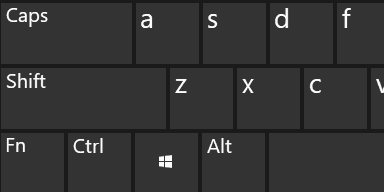

# CopyCopyDict
Background app that opens the definition or translation of a selected word with Ctrl+C+C

The tool is less than 30 KB in size and works on all versions of Windows, from Windows XP to Windows 11.

[Releases](../../releases) page

In the [CopyCopyDict.exe.config](../../blob/master/bin/Release/CopyCopyDict.exe.config) file, you can add one or more services by specifying languages and query format in the url pattern. For example:
* `https://translate.google.com/?sl=en&tl=es&text={0}`
* `https://context.reverso.net/translation/english-spanish/{0}`
* `https://www.lingvolive.com/en-us/translate/en-es/{0}`
* `https://www.thesaurus.com/browse/{0}`
